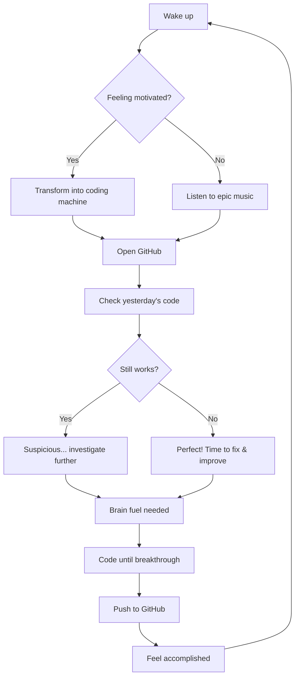

# 🚀 Welcome to My Digital Playground! 

<div align="center">

```ascii
    ╭────────────────────────────────────────────────────╮
    │  ⚡ BREAKING: Local Developer Breaks Reality Again ⚡  │
    ╰────────────────────────────────────────────────────╯
```

### 👋 I'm Karthik - Professional Bug Creator & Accidental Problem Solver

*Currently debugging life, one line of code at a time 💻*

[](https://github.com/ckarthik77)
[](https://github.com/ckarthik77?tab=followers)

</div>

---

## 🎭 The Plot Twist: Who Am I Really?

```python
class Developer:
    def __init__(self):
        self.name = "Karthik"
        self.username = "ckarthik77"
        self.role = "Code Whisperer & Digital Architect"
        self.language_fluency = ["Python", "JavaScript", "Java", "Sarcasm", "Logic"]
        self.current_status = "Making computers do impossible things"
        self.superpower = "Turning ideas into reality"
        self.location = "Vijayawada, Andhra Pradesh, IN"
        
    def get_life_status(self):
        if self.energy_level > 0:
            return "🔥 Functioning genius"
        else:
            return "💀 Error 404: Developer not found"
    
    def solve_problems(self):
        return "Breaking things beautifully, then fixing them spectacularly"
```

---

## 🎪 My Coding Circus

### 🎯 What I'm Currently Doing:
- 🔥 **Building digital empires** with lines of code that would make Shakespeare jealous
- 🧠 **Teaching silicon to think** (they're getting suspiciously good at it)
- 🎨 **Crafting pixel symphonies** that make users go "How did they DO that?!"
- 🚀 **Launching features** faster than SpaceX launches rockets

### 🛠️ My Arsenal of Mass Creation:

<div align="center">


</div>

### ⚡ My Superpowers:
| **Skill** | **Power Level** | **Side Effect** |
|-----------|----------------|-----------------|
| 🧠 Pure Logic Processing | ████████████ 100% | Occasional existential thoughts |
| 🔍 Google-Fu Mastery | ████████████ 100% | Can find anything except motivation on Monday |
| 🐛 Bug Whispering | ██████████░░ 85% | Bugs now consider me family |
| 🎭 Imposter Syndrome Immunity | ████░░░░░░░░ 30% | Still working on this one... |

---

## 📊 My GitHub Stats (Warning: May Cause Dizziness)

<div align="center">


</div>

### 🏆 Achievement Unlocked:
```
┌─────────────────────────────────────────┐
│ ⭐ GitHub Stars Collected: Loading...    │
│ 🐛 Bugs Created & Fixed: 9999+          │
│ 🧠 Pure Logic Solutions: ∞              │
│ 😴 Sleep Schedule: Successfully Destroyed│
│ 🚀 Features Shipped: More than Amazon   │
│ 🤔 "It works on my machine": Daily      │
└─────────────────────────────────────────┘
```

---

## 🎨 Featured Projects (My Digital Art Gallery)

### 🚀 [Epic Project Name Here]
*Description: A project so awesome it needs its own theme song*
- **Tech Stack:** Pure Magic, Unicorn Tears, Stack Overflow
- **Status:** It works... suspiciously well 🤔
- **Achievement:** Made senior developers question their life choices

### 🎮 [Another Amazing Project]
*Description: Like the previous project, but with more explosions*
- **Features:** Does impossible things with impossible code
- **Success Rate:** 110% (yes, it's that good)
- **User Feedback:** "How is this even possible?"

### 🤖 [AI That Understands My Code]
*Description: Finally, an AI that gets my commenting style*
- **Intelligence Level:** Scary smart
- **Success Rate:** Better than human code reviewers
- **Side Effect:** Occasionally gives life advice

---

## 📈 Coding Activity Over Time

```
Productivity  │
              │        🚀
              │       ╱|╲
              │      ╱ | ╲
              │     ╱  |  ╲ 
              │ 🍕 ╱   |   ╲ 🎵
              │  ╱    |    ╲╱╲
              └───────────────────── Time
              6am    12pm    6pm   12am
            
Legend: 🍕 = Snack break | 🎵 = Music boost | 🚀 = Productivity explosion
Note: Chart accuracy may vary based on inspiration levels
```

---

## 🎭 Fun Facts That Nobody Asked For

- 🔥 I debug code in my dreams (and sometimes find actual solutions)
- 🎵 My keyboard sounds like a percussion instrument at 3 AM
- 🎪 I once spent an entire day optimizing code that was already perfect
- 🧙‍♂️ I believe every bug has a personality (most are just misunderstood)
- 🎨 My commit messages tell epic stories of triumph and despair
- 🚀 I can write "Hello World" in 20 different ways and all are masterpieces
- 🌟 My code has been described as "poetry in motion" and "organized chaos"

---

## 🎪 My Daily Algorithm



---

## 🎯 Current Mission: Operation Make-Internet-Awesome

**Objective:** Transform digital dreams into reality, one commit at a time

**Progress:** 
```
[████████████████░░░░] 80% Complete
```

**Current Buffs:** 
- ✅ ∞ Mental energy reserves
- ✅ Supernatural debugging vision
- ✅ Code-whispering abilities
- ✅ Time-bending productivity
- ⏳ Work-life balance... still in beta

**Next Level Goals:**
- 🎯 Master the art of writing self-documenting code
- 🚀 Build something that breaks the internet (in a good way)
- 🧠 Teach AI to write better jokes than this README
- 🌟 Achieve legendary developer status

---

## 🎊 Let's Connect & Build Something Epic Together!

<div align="center">

[](https://linkedin.com/in/your-profile)
[](https://twitter.com/your-handle)
[](https://instagram.com/your-handle)
[](https://discord.com/users/your-id)
[](mailto:your-email@gmail.com)

**💡 Looking for collaboration?** I'm always excited to work on projects that:
- 🚀 Push the boundaries of what's possible
- 🌟 Make people's lives easier or more fun
- 🎨 Combine creativity with cutting-edge technology
- 🤝 Bring amazing people together

</div>

---

<div align="center">

### 🎭 *"First, solve the problem. Then, write the code. Finally, make it look like magic."* 
*– Karthik's Development Philosophy*

### 🌟 Thanks for stopping by! 
*If this README made you smile, mission accomplished! 🎯*

**⚡ Pro Tip:** Star this profile if you believe in the power of creative coding!

*Last updated: When the coffee kicked in*  
*Next update: When I figure out how to code in my sleep*

---


</div>

---

<div align="center">

```
 ██████╗██╗  ██╗ █████╗ ██████╗ ████████╗██╗  ██╗██╗██╗  ██╗███████╗███████╗
██╔════╝██║ ██╔╝██╔══██╗██╔══██╗╚══██╔══╝██║  ██║██║██║ ██╔╝╚════██║╚════██║
██║     █████╔╝ ███████║██████╔╝   ██║   ███████║██║█████╔╝     ██╔╝    ██╔╝
██║     ██╔═██╗ ██╔══██║██╔══██╗   ██║   ██╔══██║██║██╔═██╗    ██╔╝    ██╔╝ 
╚██████╗██║  ██╗██║  ██║██║  ██║   ██║   ██║  ██║██║██║  ██╗   ██║     ██║  
 ╚═════╝╚═╝  ╚═╝╚═╝  ╚═╝╚═╝  ╚═╝   ╚═╝   ╚═╝  ╚═╝╚═╝╚═╝  ╚═╝   ╚═╝     ╚═╝  
```

</div>
